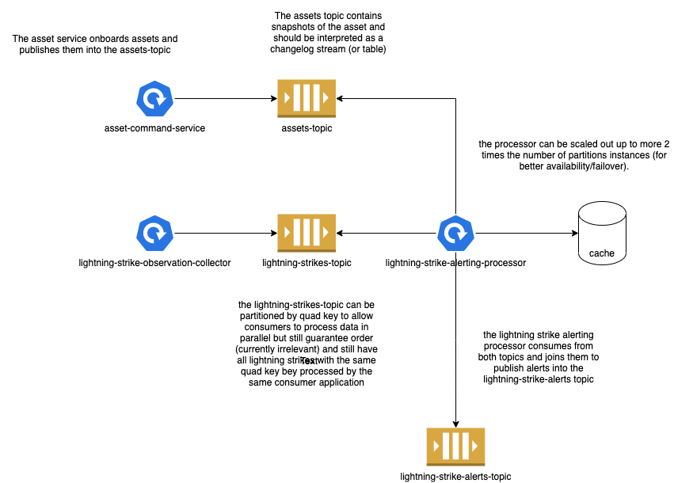

# DTN Job Interview Assignment Submission

Submitted by: Richard Kabiling

## Running the Application

The application was developed using Java 16 SDK. Please make sure that this has been setup first before proceeding witht he following steps.

The application may be run with redirected input:
```
./gradlew clean build && java -jar build/libs/dtn-lightning-alert-0.0.1-SNAPSHOT.jar < lightning.txt
```

or interactively:
```
./gradlew clean build && java -jar build/libs/dtn-lightning-alert-0.0.1-SNAPSHOT.jar
```

Note: commands like `./gradlew bootRun` (which is the common way of doing this) impedes getting lines from STDIN. 

## About the Application

### Components
The main components of the application include:
* `LightningStringFluxFactory` - responsible for reading from the STDIN and parsing into `LightningStrike` payload
* `LightningStrikeAlertService` - processes a stream of lightning strikes and publishes alerts

Its entrypoint is the `Application.run` method and it connects the `LightningStringFluxFactory` with the `LightningStrikeAlertService`.

### Spring
The application was also built on top of Spring Boot particularly in the interest of faster development during the development phase. 

Particularly, it already includes several dependencies like Jackson and Reactor which are either necessary or incredibly useful in the context of this application.
Spring also enables quick wiring of the application together via it's DI framework.
It is important to note, however that **Spring is not necessary** to develop the application and fulfill the requirements of the test.

## Reactor
Reactor allows the application to run in a non-blocking environment and in a stream like fashion. 
This also means that processing happens asynchronously.

## Requirements

### Correctness

The application has been fully tested (functional) and has a suite of unit and integration tests.

### Conciseness

The following excerpt from `LightningStrikeAlertService.java` pretty mich summarises the whole application
```java
  public Flux<AssetLightningAlert> process(Flux<LightningStrike> lightningStrikes) {
    return lightningStrikes
        .filter(ls -> ls.flashType() != FlashType.HEARTBEAT)
        .flatMap(this::joinWithAsset)
        .distinct(AssetLightningAlert::quadKey)
        .flatMap(publisher::publish);
  }
```

### Reliability

The application handles most common failures. For more information, please check the scenarios in the tests.

## Questions

### What is the time complexity for determining if a strike has occurred for a particular asset?
`Flux.distinct` uses `HashSet` for distinct detection. `HashSet` provides O(1) guarantee for `contains`.

### If we put this code into production, but found it too slow, or it needed to scale to many more users or more frequent strikes, what are the first things you would think of to speed it up?

Generally, performance is a tricky topic and requires a lot of testing (load, performance, stress, soak).

The most common and easiest ways to improve performance in deployed applications are as follows:
1. Scale out and partition workload
1. Allow asynchronous processing where applicable
1. Be reactive and non-blocking to free-up resources instead of waiting

In the case of this application, asynchronous processing and being non-blocking are already achieved by the current application.

What's left to do is to change the implementation by allowing scale out. Either:
* Have a distributed cache (instead of in-memory which is used here) to track alert status across instances
* Partition the workload by quadkey to guarantee that lightning strikes with the same quadkey are processed within the same instance.
* (or both)

Please see next section for recommended future architecture.

## Scaling Out

### Recommended Future Architecture



The following architecture employs the recommendations above and uses Kafka to scale the system out. 
It also divides the system into multiple components and allows us, the operators more fine-grained control.